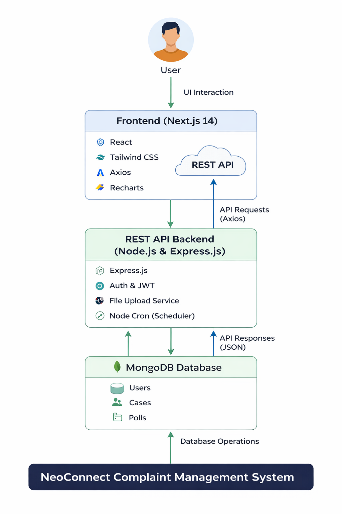

# NeoConnect Backend


---

## Project Repositories

| Service  | Repository                                                |
| -------- | --------------------------------------------------------- |
| Frontend | https://github.com/ManojkumarDevarapu/neoconnect-frontend |
| Backend  | https://github.com/ManojkumarDevarapu/neoconnect-backend  |

---

## Key Highlights

* REST API backend for NeoConnect complaint management system
* Role-based complaint and case management workflow
* Secure authentication using JWT
* Polling system for internal organizational feedback
* Analytics APIs for dashboards and complaint statistics
* MongoDB-based data persistence with Mongoose ODM

---

Backend service for the **NeoConnect Complaint Management System**. This API handles authentication, complaint management, polling, analytics, and database operations.

The backend is built with **Node.js, Express, and MongoDB** and exposes REST APIs consumed by the NeoConnect frontend application.

---

# Project Overview

NeoConnect is a **centralized complaint management platform** designed to help organizations collect, track, and resolve complaints efficiently.

The backend provides:

* Secure authentication system
* Complaint case management
* Poll and feedback collection
* Time tracking for complaints
* Analytics endpoints
* User management
* Database seeding utilities

---

# Backend Architecture

The backend serves as the **core service layer** connecting the frontend application to the database.



Architecture Flow:

```text
Client (Next.js Frontend)
        │
        ▼
 REST API (Express Server)
        │
        ▼
Controllers / Routes
        │
        ▼
Mongoose Models
        │
        ▼
MongoDB Database
```

---

# Tech Stack

Backend technologies used:

* **Node.js**
* **Express.js**
* **MongoDB**
* **Mongoose**
* **JWT Authentication**
* **dotenv**
* **REST API architecture**

---

# Project Structure

```text
backend
│
├── docs
│   └── screenshots
│       └── architecture.png
│
├── middleware
│   └── auth.js            # JWT authentication middleware
│
├── models
│   ├── Case.js            # Complaint case schema
│   ├── Minutes.js         # Meeting / tracking records
│   ├── Poll.js            # Poll and voting schema
│   └── User.js            # User schema
│
├── routes
│   ├── analytics.js       # Dashboard analytics APIs
│   ├── auth.js            # Authentication routes
│   ├── cases.js           # Complaint management
│   ├── hub.js             # Hub related operations
│   ├── polls.js           # Polling routes
│   └── users.js           # User management
│
├── .env.example           # Environment variable template
├── seed.js                # Database seed script
├── server.js              # Application entry point
├── package.json
└── .gitignore
```

---

# Core Features

## Authentication

Secure login system using **JWT tokens**.

Features:

* User registration
* Login authentication
* Protected routes
* Token validation middleware

---

## Complaint Case Management

Users can:

* Create complaint cases
* Track complaint progress
* Update case status
* View case history

Admins can:

* Manage cases
* Update resolution status
* Monitor complaints

---

## Polling System

The system supports **internal polls** for decision making.

Capabilities:

* Create polls
* Vote on options
* Store results
* Retrieve poll analytics

---

## Analytics API

Provides data for dashboards such as:

* Total complaints
* Resolved complaints
* Pending complaints
* Poll statistics
* User activity

---

# Database Models

### User

Stores user authentication and profile data.

### Case

Represents complaint cases submitted by users.

### Poll

Stores poll questions and responses.

### Minutes

Stores meeting minutes or activity logs.

---

# Environment Variables

Create a `.env` file using `.env.example`.

Example:

```env
PORT=5000
MONGO_URI=your_mongodb_connection
JWT_SECRET=your_secret_key
```

---

# Installation

Clone the repository

```bash
git clone https://github.com/yourusername/neoconnect-backend.git
```

Navigate to the project

```bash
cd neoconnect-backend
```

Install dependencies

```bash
npm install
```

---

# Running the Server

Development

```bash
npm run dev
```

Production

```bash
npm start
```

Server runs on:

```
http://localhost:5000
```

---

# Database Seeding

Populate the database with sample data:

```bash
node seed.js
```

---

# API Endpoints

Main endpoints:

```
/api/auth
/api/cases
/api/users
/api/polls
/api/analytics
/api/hub
```

---

# Security

Security practices implemented:

* JWT authentication
* Password hashing
* Protected API routes
* Environment variable protection

---

# Future Improvements

Possible enhancements:

* Email notifications
* File attachments for complaints
* Role based access control
* Real-time updates using WebSockets
* Microservice architecture

---

# Author

Developed as part of the **NeoConnect Complaint Management System**.
